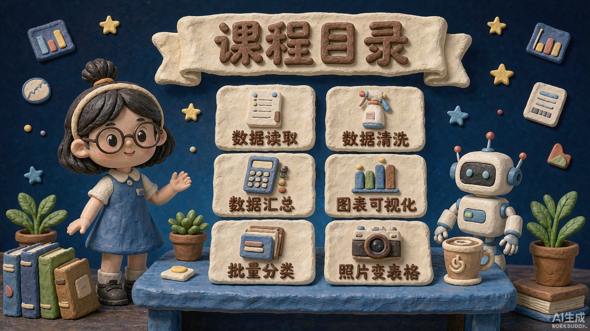

# meiyao-clay-ppt · 黏土风课件生成器

> 一套跑在 **WorkBuddy 原生环境**里的黏土风（polymer-clay diorama）PPT / 课件生成技能。
> 用内置 ImageGen 出图 + python-pptx 合成**可编辑**的 16:9 演示文稿。




---

## 核心原理：文字是「捏」出来的，不是「贴」上去的

这是整套效果成立与否的分水岭，也是**照着做却做不出同款的头号原因**。

黏土风好看，是因为画面里所有东西都在同一个物理世界里——**文字也一样**。
标题必须是一个个**厚实的立体黏土字块**，坐在黏土铭牌上，有厚度、有圆边、有指纹、有投影。

> ❌ **错误做法**：出图时留一块空铭牌 → 再用 PPT 脚本叠一行扁平黑体字。
> 扁平字没有厚度和阴影，和其他黏土件不在一个光照体系里，观感瞬间掉档。
>
> ✅ **正确做法**：把中文写进出图 prompt，明确要求
> `sculpted from thick 3D polymer-clay letters ... NOT flat printed text`。

上面那张目录页是同一套方法的第二个验证：**7 处中文全部正确**，
标题「课程目录」与六张卡片标签（数据读取 / 数据清洗 / 数据汇总 / 图表可视化 / 批量分类 / 照片变表格）
都是捏出来的黏土立体字。

| 文字类型 | 做法 |
|---|---|
| 标题 / 页眉 / 卡片标签 / 编号 | ✅ 烘进图，黏土立体字 |
| 成段正文 | ⚠️ 才走脚本叠加（`text_mode: "overlay"`） |
| 讲师备注 | 脚本写入 notes，不进画面 |

## 它能做什么

给一个主题（比如"Excel 数据处理实战"），自动产出一整套**手工黏土定格动画质感**的幻灯片：

- Q 版黏土讲师形象（发型 / 发饰 / 眼镜 / 服装可定制）
- 微缩黏土场景 + 奶油色黏土铭牌 + **捏出来的中文黏土立体字**
- 输出 `.pptx`（含讲师备注；正文可选叠加为可编辑文本）

## 为什么是"原生"

| | 外部 Codex 版 skill | 本 skill |
|---|---|---|
| 出图 | Codex Image2 | **WorkBuddy 内置 ImageGen** |
| 合成 | 外部脚本 | **python-pptx**（本仓库自带） |
| 额外 hook | 可能混入审美检查流程 | **无，纯本流程** |
| 成本控制 | — | **三步确认法，逐张确认不浪费额度** |

## 核心：三步确认法

**绝不一上来批量出图**，按下面顺序逐步确认：

1. **角色锚点** — 出 1 张 `1024×1024`，确认人物特征
2. **封面** — 出 1 张 `1024×576`，主标题以**黏土立体字**烘进图，确认整页效果
3. **批量内页** — 确认后才生成目录 + 内容页 + 总结页（**每页标题同样烘进图**）
4. **合成** — `scripts/build_pptx.py` 铺满页面 + 写入讲师备注

## 安装

```bash
git clone https://github.com/ywu661266-vicky/meiyao-clay-ppt.git ~/.workbuddy/skills/meiyao-clay-ppt
```

或把本目录整个复制到 `~/.workbuddy/skills/` 下即可。

## 触发方式

在 WorkBuddy 里说：

- "做一套黏土风 PPT"
- "把这个主题做成黏土风"
- "要 Q 版讲师形象的幻灯片"
- "clay style ppt"

## 目录结构

```
meiyao-clay-ppt/
├── SKILL.md                        # 主流程（第一性原理 / 触发词 / 三步确认法）
├── README.md                       # 本文件
├── LICENSE                         # MIT
├── references/
│   ├── workflow.md                 # 三步确认法细节 + 翻车对策
│   ├── prompts.md                  # 实测通过的提示词模板（含黏土立体字标准段）
│   ├── style-system.md             # 配色 / 材质 / 构图 / 文字规范
│   └── imagegen-params.md          # ImageGen 参数与踩坑
├── scripts/
│   └── build_pptx.py               # 页面图 → 16:9 PPTX（默认不叠扁平字）
└── assets/examples/                # 成功样例（角色锚点 / 封面 / 目录页）
```

## 关键发现（踩坑记录）

- **文字必须烘进图，且必须写成黏土立体字。** 用脚本叠扁平字 = 一眼假。prompt 里必须带
  `sculpted from thick 3D polymer-clay letters ... not flat printed text`；
  同时**不要**再写旧版的 `No written words`。
- WorkBuddy ImageGen **没有 `aspect_ratio` 参数**，比例只能用 `size`（16:9 → `1024x576`，角色 → `1024x1024`）。
- 混元 **能渲染可读中文**：中文字符串用单引号写进 prompt，并追加
  `Make every Chinese character clearly readable and correctly formed, no garbled characters.`
  - 实测：13 字中英混排标题（`AI + Excel 数据处理实战`）✅
  - 实测：一页 7 处中文（1 个标题 + 6 个卡片标签）✅
  - 保险做法：标题 ≤ 8 字、卡片标签 ≤ 5 字。
- 内置出图右下角固定 `AI生成 WORKBUDDY` 水印，版式需避开右下角。
- **不要用同一张图既烘字又叠字**：`slides.json` 里烘过字的页不要再写 `title`，
  否则会压出两层标题（脚本默认 `text_mode: "baked"` 已自动跳过叠字并告警）。

## License

MIT
